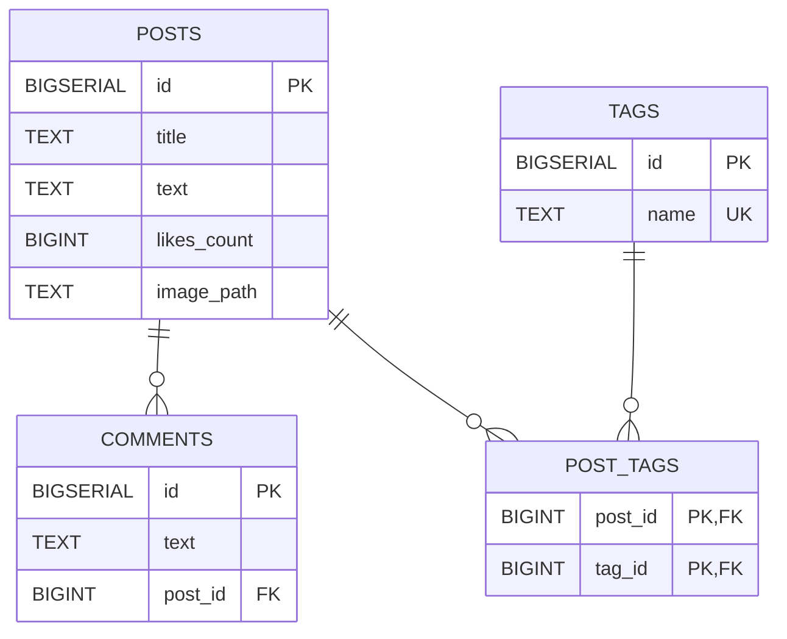

# My Blog Backend

Backend для блога на Java 21 и Spring MVC. Приложение предоставляет REST API для работы с постами, тегами, комментариями, лайками и изображениями постов. Данные хранятся в PostgreSQL через Spring JDBC, изображения — в файловой системе.

Загрузка изображений ограничена 5 МБ на файл и 6 МБ на multipart-запрос. По умолчанию разрешены PNG, JPEG и GIF; сервер определяет фактический тип файла по его содержимому.

Приложение собирается в WAR и запускается в Tomcat.

## Разрешённые типы изображений

Список разрешённых типов задаётся в `application.properties` как перечень типов через запятую:

```properties
blog.image.allowed-types=${BLOG_IMAGE_ALLOWED_TYPES:image/png,image/jpeg,image/gif}
```

Для переопределения при запуске укажите переменную окружения, например:
Пустой список считается ошибкой конфигурации.

Значение должно совпадать с типом, который Apache Tika определяет по содержимому файла. Следует указывать `image/png`, а не расширение `png` или `.png`.
Полный перечень форматов и соответствующих MIME-типов приведён в [официальной документации Apache Tika 3.3.2](https://tika.apache.org/3.3.2/formats.html).

## Модули

- `my-blog-back-app-bom` — единое управление версиями зависимостей.
- `my-blog-back-api` — контракты REST-контроллеров и DTO.
- `my-blog-back-impl` — реализация контроллеров, сервисы, JDBC-репозитории, модели, конфигурация и файловое хранилище. Результат сборки — WAR.
- Корневой `pom.xml` — Maven-агрегатор и общие настройки Java 21.

## Схема базы данных

Приложение использует схему PostgreSQL `my_blog`, которая при отсутствии создаётся автоматически из `my-blog-back-impl/src/main/resources/schema.sql`.



Один пост может иметь несколько комментариев и тегов. Связь постов с тегами реализована через таблицу `post_tags`. Поле `tags.name` уникально. При удалении поста удаляются его комментарии и связи с тегами; при удалении тега удаляются его связи с постами.

## Требования

- JDK 21;
- Maven 3.9+;
- PostgreSQL;
- Tomcat 11;
- Docker — только для интеграционных тестов с Testcontainers.

## Переменные окружения

| Переменная | Обязательна | Описание / значение по умолчанию |
| --- | --- | --- |
| `BLOG_DATASOURCE_URL` | да | JDBC URL, например `jdbc:postgresql://localhost:5432/postgres` |
| `BLOG_DATASOURCE_USERNAME` | да | Пользователь PostgreSQL |
| `BLOG_DATASOURCE_PASSWORD` | да | Пароль PostgreSQL |
| `BLOG_DATASOURCE_SCHEMA` | нет | Схема БД, по умолчанию `my_blog` |
| `BLOG_IMAGE_STORAGE_DIRECTORY` | нет | Каталог изображений, по умолчанию `./data/images` Используйте абсолютный путь для каталога изображений.|
| `BLOG_IMAGE_CLEANUP_FIXED_DELAY_MS` | нет | Интервал между запусками очистки изображений, по умолчанию `60000` мс |
| `BLOG_IMAGE_CLEANUP_INITIAL_DELAY_MS` | нет | Задержка первого запуска очистки изображений, по умолчанию `60000` мс |
| `BLOG_IMAGE_CLEANUP_BATCH_SIZE` | нет | Количество задач очистки в одном пакете, по умолчанию `100` |
| `BLOG_IMAGE_CLEANUP_MAX_BATCHES_PER_RUN` | нет | Максимальное количество пакетов за один запуск, по умолчанию `10` |
| `BLOG_IMAGE_ALLOWED_TYPES` | нет | Разрешённые MIME-типы изображений через запятую, по умолчанию `image/png,image/jpeg,image/gif` |

При старте приложение выполняет `schema.sql` и создаёт недостающие объекты. 

## Сборка и тесты

Полная сборка с тестами:

```bash
mvn clean package
```

Для интеграционных тестов должен работать Docker. Собрать WAR без тестов можно с помощью:

```bash
mvn clean package -DskipTests
```

Готовый файл появится в `my-blog-back-impl/target/my-blog-back-impl-1.0-SNAPSHOT.war`.

## Запуск и деплой в Tomcat

Перед запуском передайте переменные окружения процессу Tomcat. Для постоянной конфигурации их можно добавить в `$CATALINA_BASE/bin/setenv.sh`:

```bash
export BLOG_DATASOURCE_URL=jdbc:postgresql://localhost:5432/postgres
export BLOG_DATASOURCE_USERNAME=blog
export BLOG_DATASOURCE_PASSWORD=change-me
export BLOG_DATASOURCE_SCHEMA=my_blog
export BLOG_IMAGE_STORAGE_DIRECTORY=/var/lib/my-blog/images
export BLOG_IMAGE_CLEANUP_FIXED_DELAY_MS=60000
export BLOG_IMAGE_CLEANUP_INITIAL_DELAY_MS=60000
export BLOG_IMAGE_CLEANUP_BATCH_SIZE=100
export BLOG_IMAGE_CLEANUP_MAX_BATCHES_PER_RUN=10
```

Соберите и скопируйте WAR:

```bash
mvn clean package -DskipTests
cp my-blog-back-impl/target/my-blog-back-impl-1.0-SNAPSHOT.war \
  "$CATALINA_BASE/webapps/api.war"
"$CATALINA_BASE/bin/catalina.sh" run
```

Имя `api.war` задаёт context path `/api`, поэтому endpoint постов будет доступен по адресу `http://localhost:8080/api/posts`. Для остановки используйте `"$CATALINA_BASE/bin/catalina.sh" stop`.
